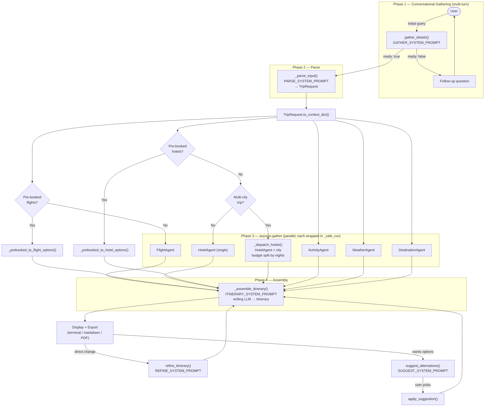
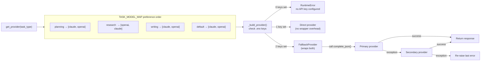
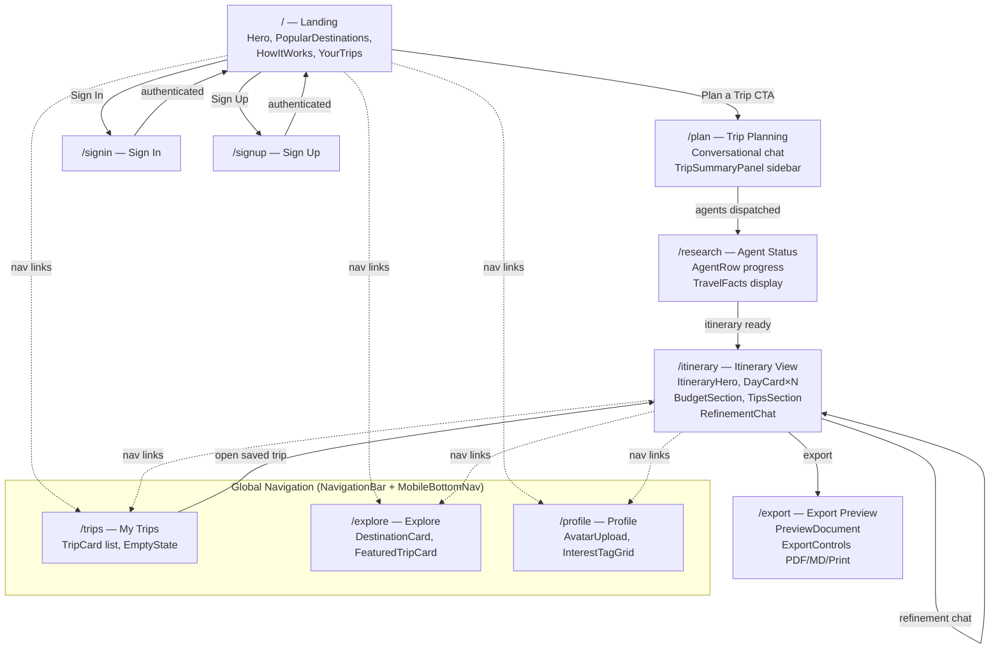
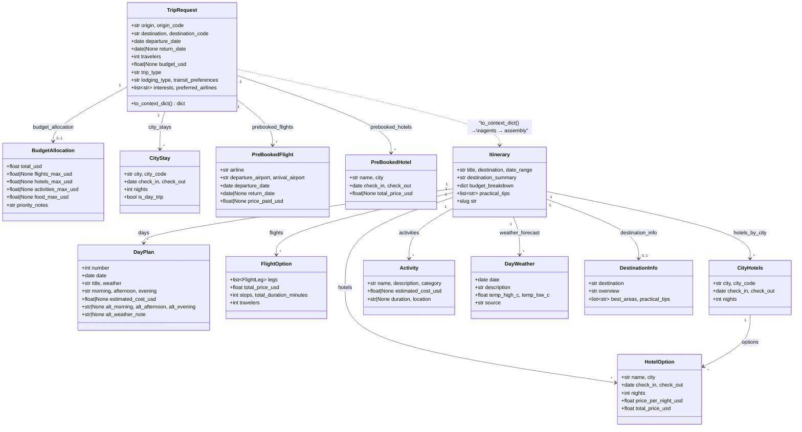

# Voyager AI — Architecture Diagrams

---

## 1. Agent Orchestration Flow

The full planning pipeline from first user message to exported itinerary.

> **Error isolation:** every agent runs inside `_safe_run()`. A single agent failure returns its default (empty list or `None`) without cancelling the other agents or the assembly step.

---

## 2. LLM Routing & Fallback

How `get_provider(task_type)` selects and wraps providers at runtime.

> **Providers:** `ClaudeProvider` wraps `anthropic` SDK (`claude-sonnet-4-20250514` default), `OpenAIProvider` wraps `openai` SDK (`gpt-4o` default). Both defaults are overridable via `.env`.

---

## 3. Frontend Page Flow

User journey through the React SPA (`frontend/src/app/routes.ts`).

> **No API layer yet.** The frontend is currently a standalone SPA — all data is mocked or passed via component props. Connecting it to the Python backend via a REST/WebSocket API is a future milestone.

---

## 4. Data Model Relationships

How data flows from a raw conversation through to a final `Itinerary`.

